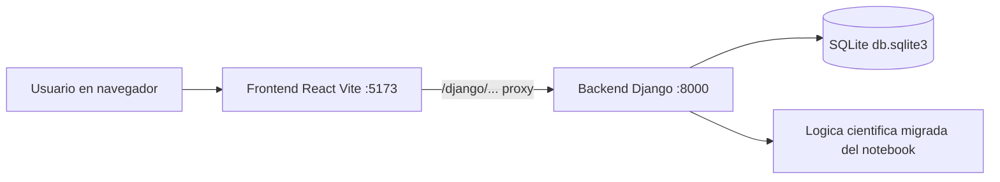

# Manual del Proyecto Tesis (Django + React + Notebook)

Fecha de corte: 2026-07-27

Este documento resume todo lo implementado en el proyecto hasta la fecha: estructura, stack tecnico, librerias, endpoints, partes clave del codigo, flujo de ejecucion y troubleshooting.

## Descripcion general del proyecto

Este proyecto de tesis consiste en el diseno e implementacion de una plataforma de simulacion nuclear orientada a fines academicos, de divulgacion tecnica y de apoyo didactico. El sistema integra en una sola solucion tres componentes que normalmente se encuentran separados: calculo cientifico, visualizacion interactiva y consumo web accesible desde navegador. La motivacion principal es transformar modelos fisicos originalmente construidos en formato de notebook en una aplicacion estructurada, mantenible y preparada para evolucionar en escenarios reales de uso.

En el contexto de la formacion en fisica nuclear, una dificultad recurrente es que muchos contenidos se presentan de forma teorica o mediante herramientas aisladas que no facilitan el aprendizaje progresivo. Por ejemplo, un notebook permite probar formulas y experimentar con datos, pero no siempre ofrece una experiencia robusta para usuarios finales, ni una arquitectura clara para separar responsabilidades entre interfaz, logica de negocio y exposicion de servicios. Este proyecto responde a ese problema al migrar capacidades cientificas a una arquitectura cliente-servidor, donde cada capa cumple una funcion definida y puede evolucionar de forma independiente.

Desde una perspectiva funcional, la plataforma permite ejecutar simulaciones asociadas a procesos nucleares relevantes, incluyendo metodos de Monte Carlo para experimentacion estocastica, analisis de dispersion elastica, modelos de decaimiento radiactivo y visualizaciones relacionadas con fenomenos de fision. Estas capacidades se exponen mediante una API REST en Django y se consumen en un frontend web implementado con React, Vite y TypeScript. Esta decision tecnologica no es casual: se busca combinar confiabilidad del backend, flexibilidad de integracion y una experiencia visual interactiva en el navegador.

Uno de los aportes centrales del proyecto es la formalizacion del ciclo de trabajo cientifico dentro de una aplicacion de software. En lugar de depender de celdas de notebook con ejecucion manual, la logica se encapsula en endpoints con entradas y salidas definidas, lo cual mejora trazabilidad, repetibilidad y control de errores. Este enfoque permite que el mismo motor de calculo sea reutilizado por distintas interfaces (web actual, aplicacion movil futura, o incluso clientes externos), sin duplicar algoritmos ni perder consistencia en resultados.

En terminos de arquitectura, el sistema adopta una separacion clara de capas:

- Capa de presentacion: frontend React con componentes reutilizables y secciones de simulacion especializadas.
- Capa de servicios: API REST en Django encargada de validar entradas, ejecutar calculos y retornar resultados estructurados.
- Capa de soporte de datos: base SQLite local para persistencia minima y soporte de configuraciones internas.
- Capa de activos cientificos: logica migrada desde notebook y recursos HTML integrados para visualizaciones concretas.

Esta separacion aporta ventajas directas para un proyecto de tesis: facilita justificar decisiones de ingenieria, permite medir comportamiento por modulo, simplifica pruebas puntuales y habilita extensiones sin redisenar todo el sistema. En otras palabras, la propuesta trasciende la demostracion tecnica puntual y se orienta a construir una base metodologica reproducible.

El backend del proyecto se implementa con Django y Django REST Framework. Django aporta una estructura madura para enrutamiento, configuracion, seguridad base y organizacion por aplicaciones. DRF, por su parte, permite definir endpoints de manera consistente, con respuestas JSON aptas para clientes heterogeneos. En este proyecto, el backend no se limita a devolver datos estaticos: realiza procesamiento numerico, ejecuta modelos de simulacion y publica resultados en formatos consumibles por visualizaciones web.

El frontend se desarrolla con React + TypeScript + Vite, una combinacion elegida por productividad, tipado estatico y rendimiento en desarrollo. React facilita el trabajo por componentes y la composicion de secciones de simulacion independientes. TypeScript ayuda a controlar contratos de datos con la API y reduce errores por estructuras JSON inesperadas. Vite ofrece recarga rapida y un entorno de desarrollo agil. Adicionalmente, se incluyen librerias de visualizacion y 3D para enriquecer la comprension de fenomenos fisicos complejos.

La integracion entre frontend y backend se resuelve por medio de rutas proxy durante el desarrollo, lo cual evita problemas de origen cruzado y aproxima el comportamiento a un despliegue unificado. Esta decision permite que el equipo de trabajo y evaluadores de tesis puedan ejecutar el proyecto localmente con menor friccion, manteniendo una experiencia de uso continua: el usuario interactua con formularios, parametros de simulacion y paneles de resultados sin preocuparse por la complejidad interna del flujo.

Un aspecto relevante de la propuesta es la migracion desde el notebook tesis_lab_nuclear.ipynb. El notebook conserva valor como laboratorio exploratorio, pero su contenido se transforma gradualmente en funciones y endpoints reutilizables. Esta migracion implica seleccionar logica estable, encapsular calculos, estandarizar entradas, normalizar salidas y gestionar errores. El resultado es una evolucion desde un entorno de experimentacion individual hacia un producto digital con estructura de software ingenieril.

En cuanto al alcance cientifico actual, el sistema cubre los siguientes ejes:

- Simulacion Monte Carlo para analizar eventos probabilisticos y comportamiento bajo incertidumbre.
- Dispersion elastica para estudiar relaciones entre energia, angulo y respuesta de particulas.
- Decaimiento radiactivo para observar variacion temporal de isotopos y posibles cadenas de transformacion.
- Visualizaciones de fision y reactor con apoyo grafico para comprension conceptual.

Cada eje funciona como un modulo autocontenido desde el punto de vista del usuario, pero comparte infraestructura comun desde el punto de vista del software. Esta combinacion entre autonomia funcional e integracion tecnica es clave para sostener mantenibilidad: se pueden agregar nuevos experimentos sin romper los modulos existentes, siempre que respeten contratos de API y convenciones del frontend.

Desde la perspectiva academica, el valor del proyecto se puede explicar en tres niveles. Primero, nivel pedagogico: convierte contenido abstracto en una experiencia interactiva que mejora comprension y exploracion. Segundo, nivel metodologico: documenta una ruta de migracion de prototipos cientificos a aplicaciones estructuradas. Tercero, nivel tecnologico: deja una base preparada para escalar hacia autenticacion, persistencia avanzada, trazabilidad de ejecuciones y eventual despliegue en infraestructura de produccion.

Tambien es importante destacar que el proyecto prioriza robustez operativa en el flujo cliente-servidor. Durante el desarrollo se identificaron y corrigieron problemas de integracion tipicos, como desalineacion de puertos en proxy y respuestas vacias que afectaban el parseo JSON en frontend. Estas correcciones fortalecen la confiabilidad de la plataforma y evidencian una practica de ingenieria iterativa, donde la validacion funcional y la depuracion forman parte explicita del resultado final.

En su estado actual, el sistema se comporta principalmente como un motor de simulacion y visualizacion. La base de datos SQLite cumple una funcion de soporte, mientras que el nucleo de valor se encuentra en los calculos fisicos y su presentacion interactiva. Esta condicion es coherente con el objetivo de tesis en su fase presente: demostrar integracion efectiva entre ciencia computacional y desarrollo de software aplicado.

Respecto a escalabilidad, el proyecto ya contempla lineas de crecimiento concretas. Entre ellas se encuentran la incorporacion de autenticacion para perfiles de usuario, almacenamiento de historiales de simulacion, definicion de modelos de dominio mas ricos, generacion de reportes exportables y pruebas automatizadas de mayor cobertura. Estas mejoras no requieren reescribir la arquitectura base, sino extenderla sobre patrones ya establecidos, lo cual valida la eleccion inicial del stack.

Otro elemento diferenciador es la coexistencia de un modulo movil legado en Expo junto al frontend web principal. Aunque la aplicacion movil no es el foco actual, su presencia muestra que la logica central puede ser consumida por distintos clientes si la API se mantiene estable. Este punto refuerza una conclusion importante para la tesis: cuando el conocimiento cientifico se encapsula como servicio, la interfaz se vuelve intercambiable y el sistema gana vida util.

Finalmente, la descripcion general de este proyecto puede sintetizarse como la construccion de una plataforma academica de simulacion nuclear que traduce teoria en experimentacion interactiva, y experimentacion en software mantenible. El trabajo integra fundamentos de fisica, programacion cientifica, desarrollo web moderno y principios de arquitectura de software. El resultado no es solo una coleccion de simulaciones, sino una base de producto tecnico con potencial de continuidad investigativa, docente y aplicada.

En consecuencia, el proyecto aporta tanto en contenido disciplinar como en estrategia de implementacion. Por un lado, habilita el estudio de fenomenos nucleares mediante herramientas accesibles y visuales. Por otro lado, demuestra que una aproximacion ordenada de migracion, modularizacion e integracion API puede convertir prototipos academicos en soluciones extensibles. Esa doble contribucion, cientifica y de ingenieria, constituye el nucleo de valor de la presente tesis.

## 1. Objetivo del proyecto

Proyecto academico de fisica nuclear con:

- Backend API en Django REST.
- Frontend web en React + Vite + TypeScript.
- Migracion de logica desde notebook de Jupyter.
- Modulos de simulacion: Monte Carlo, dispersion elastica, reactor, decaimiento, y visualizacion de fision.

## 2. Estructura real del workspace

```text
c:/Users/jose.valdez/Downloads/tesis/
  .venv/                       # entorno virtual externo (utilizado en algunas pruebas)
  tesis/
    backend/                   # backend Django
      .venv/                   # entorno virtual principal del backend
      api/
      config/
      db.sqlite3
      manage.py
    frontend/                  # frontend React web con Vite
      src/
      package.json
      vite.config.ts
    mobile/                    # app Expo legacy/opcional
    tesis_lab_nuclear.ipynb    # notebook fuente
    README.md
```

## 3. Arquitectura general



Notas:

- En desarrollo, el frontend usa proxy de Vite para hablar con Django.
- El backend expone endpoints REST y rutas HTML para simulacion/landing.

## 4. Librerias utilizadas

## 4.1 Backend Python (entorno backend/.venv)

Listado obtenido con pip list --format=freeze:

- asgiref==3.11.1
- contourpy==1.3.3
- cycler==0.12.1
- Django==6.0.7
- django-cors-headers==4.9.0
- djangorestframework==3.17.1
- fonttools==4.63.0
- kiwisolver==1.5.0
- matplotlib==3.11.0
- mpmath==1.3.0
- networkx==3.6.1
- numpy==2.5.1
- packaging==26.2
- pandas==3.0.3
- pillow==12.3.0
- pip==26.1.2
- pyparsing==3.3.2
- python-dateutil==2.9.0.post0
- radioactivedecay==0.6.1
- scipy==1.18.0
- six==1.17.0
- sqlparse==0.5.5
- sympy==1.14.0
- tzdata==2026.3

Paquetes clave funcionales:

- Django: framework backend.
- djangorestframework: API REST.
- django-cors-headers: CORS para frontend local.
- radioactivedecay: calculo de cadenas de decaimiento.
- matplotlib/pillow: exportacion y render de imagenes de cadena.
- numpy/scipy/pandas: soporte numerico/cientifico.

## 4.2 Frontend web (frontend/package.json)

Dependencias:

- react
- react-dom
- @react-three/fiber
- @react-three/drei
- three
- recharts
- lucide-react

DevDependencies (tooling):

- vite
- @vitejs/plugin-react
- typescript
- eslint + plugins
- tailwindcss + postcss + autoprefixer

## 4.3 Mobile legacy (mobile/package.json)

- expo
- react-native
- react-native-web
- react, react-dom

Se mantiene como modulo legado; el producto principal actual es frontend web.

## 5. Configuracion clave

## 5.1 Django settings

- DB: SQLite local (db.sqlite3).
- Apps habilitadas: api, rest_framework, corsheaders.
- CORS permitido para localhost/127.0.0.1 en puertos 5173, 8081, 19006.

Referencia:

- backend/config/settings.py

## 5.2 Enrutamiento principal

- Raiz / y /principal/ renderiza pagina principal.
- /fision/ renderiza simulacion de fision.
- /api/ incluye rutas REST del app api.

Referencia:

- backend/config/urls.py
- backend/api/urls.py

## 5.3 Proxy frontend -> backend

El frontend usa prefijo /django y lo reescribe hacia Django.

Config actual correcta:

- target: http://127.0.0.1:8000

Referencia:

- frontend/vite.config.ts

## 6. Endpoints implementados (backend/api/views.py)

Health y utilidades:

- GET /api/health/

Fisica basica migrada:

- POST /api/energia-final/
- POST /api/monte-carlo/

Simulaciones usadas por frontend nuevo:

- POST /api/simulations/monte-carlo-fission/
- POST /api/simulations/scattering-elastic/
- POST /api/simulations/radioactive-decay/
- POST /api/simulations/radioactive-decay-chain-export/
- GET /api/simulations/radioactive-decay-chain-image/

Paginas HTML integradas:

- GET /api/fision/
- GET /api/principal/

## 7. Partes clave del codigo (resumen)

## 7.1 Backend scientific core

Archivo principal:

- backend/api/views.py

Bloques importantes:

- Extraccion de HTML desde notebook:
  - _extract_html_from_notebook_variable
  - _extract_html_fision_from_notebook
  - _extract_html_principal_from_notebook
- Formula energia final:
  - energia_final_formula
- Monte Carlo base:
  - monte_carlo_formula
  - _poisson
- Endpoints API con @api_view para cada modulo.

## 7.2 Frontend app shell y modulos

Archivo principal de composicion:

- frontend/src/App.tsx

Secciones funcionales:

- frontend/src/sections/MonteCarloSection.tsx
- frontend/src/sections/ElasticScatteringSection.tsx
- frontend/src/sections/DecaySection.tsx
- frontend/src/sections/ReactorSection.tsx
- frontend/src/sections/Simulation3DSection.tsx

## 7.3 Manejo de fetch y parse JSON

Mejora aplicada:

- Antes: se llamaba res.json() directo.
- Ahora: se hace res.text() y parse seguro con mensajes claros.

Errores amigables agregados:

- Respuesta vacia del servidor (HTTP ...)
- Respuesta invalida del servidor (HTTP ...)

Archivos ajustados:

- frontend/src/sections/MonteCarloSection.tsx
- frontend/src/sections/ElasticScatteringSection.tsx
- frontend/src/sections/DecaySection.tsx

## 8. Error que se corrigio hoy

Error observado:

- Failed to execute 'json' on 'Response': Unexpected end of JSON input

Causa raiz:

- El proxy de Vite apuntaba a 8001 mientras Django corria en 8000.
- Resultado: 502 o cuerpo vacio en algunas respuestas, luego fallaba res.json().

Correccion aplicada:

- frontend/vite.config.ts cambio de 8001 -> 8000 en /django, /fision y /principal.
- Endurecimiento del parse de respuestas en secciones frontend.

Validacion posterior:

- GET http://127.0.0.1:5173/django/api/health/ devuelve JSON correcto.
- POST de simulacion devuelve JSON correcto.
- npm run build en frontend compila sin errores.

## 9. Como ejecutar todo (paso a paso)

## 9.1 Backend Django

Desde cualquier ruta:

```powershell
& "c:/Users/jose.valdez/Downloads/tesis/tesis/backend/.venv/Scripts/python.exe" "c:/Users/jose.valdez/Downloads/tesis/tesis/backend/manage.py" runserver 127.0.0.1:8000
```

## 9.2 Frontend web

```powershell
npm --prefix "c:/Users/jose.valdez/Downloads/tesis/tesis/frontend" run dev -- --host 127.0.0.1
```

## 9.3 URLs de trabajo

- Frontend: http://127.0.0.1:5173
- Backend: http://127.0.0.1:8000
- Health via proxy: http://127.0.0.1:5173/django/api/health/
- Health directo: http://127.0.0.1:8000/api/health/

## 10. Flujo funcional recomendado para pruebas

1. Levantar backend.
2. Levantar frontend.
3. Abrir frontend y ejecutar modulo Monte Carlo.
4. Ejecutar Dispersion elastica.
5. Ejecutar Decaimiento radiactivo.
6. Confirmar que no hay errores de parse JSON en consola.

## 11. Estado de base de datos y modelos

- DB actual: SQLite local.
- api/models.py sin modelos de negocio definidos aun.
- api/tests.py aun sin pruebas funcionales.

Implicacion:

- El proyecto funciona principalmente como motor de simulacion y visualizacion, mas que como sistema transaccional persistente.

## 12. Riesgos y pendientes

- Falta cobertura de tests automatizados backend/frontend.
- SECRET_KEY de desarrollo visible en settings (normal en local, no para produccion).
- Migrar configuracion sensible a variables de entorno para despliegue real.
- Definir modelos y autenticacion (si aplica a tesis final).

## 13. Troubleshooting rapido

1. Error No module named django:
- Verificar que se use python de backend/.venv.

2. Error Unexpected end of JSON input:
- Revisar proxy en frontend/vite.config.ts (debe apuntar a puerto real de Django).
- Verificar que Django este arriba en ese puerto.

3. Frontend no conecta al backend:
- Probar health por proxy y directo.
- Revisar CORS_ALLOWED_ORIGINS en settings.py.

4. Problemas con npx/npm en Windows:
- Revisar PATH de sesion en VS Code.

## 14. Referencias de archivos clave

- README.md
- backend/manage.py
- backend/config/settings.py
- backend/config/urls.py
- backend/api/urls.py
- backend/api/views.py
- frontend/package.json
- frontend/vite.config.ts
- frontend/src/App.tsx
- frontend/src/sections/MonteCarloSection.tsx
- frontend/src/sections/ElasticScatteringSection.tsx
- frontend/src/sections/DecaySection.tsx
- tesis_lab_nuclear.ipynb

## 15. Version corta para presentacion

Si necesitas exponer rapido el proyecto:

- Backend Django REST para calculos/simulaciones nucleares.
- Frontend React para experiencia interactiva modular.
- Logica cientifica migrada desde notebook a API mantenible.
- Error de integracion frontend-backend resuelto (proxy/puertos).
- Proyecto listo para agregar autenticacion, modelos y pruebas.
